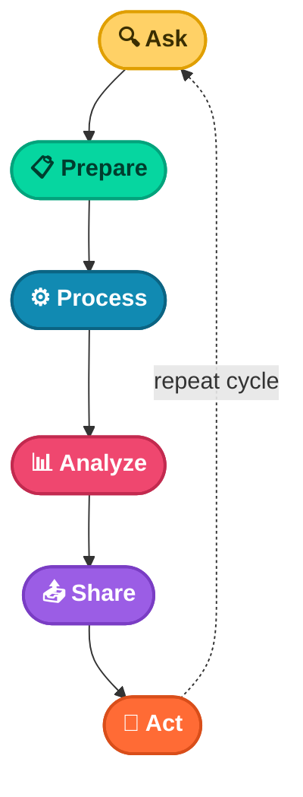

# Chapter 1: People Analytics & The Data Analysis Process

---

## Overview

Data is everywhere. Any time you observe and evaluate something in the world, you are collecting and analyzing data. This helps you:

- Find easier ways of doing things.
- Identify patterns that save you time.
- Discover surprising new perspectives that can change how you experience things.

This chapter tells a real-life story of how a team of data analysts used the **six steps of data analysis** to solve a workplace problem. Their story involves something called **people analytics**.

---

## What Is People Analytics?

> People analytics (also known as human resources analytics or workforce analytics) is the practice of collecting and analyzing data on the people who make up a company's workforce. The goal is to gain insights to improve how the company operates.

Being a people analyst means using data to understand employees and how they experience their work lives. These insights help:

- Create a more productive and empowering workplace.
- Unlock employee potential.
- Motivate people to perform at their best.
- Ensure a fair and inclusive company culture.

---

## The Six Steps of Data Analysis

The six steps of the data analysis process are: **ask, prepare, process, analyze, share, and act**. These steps apply to any data analysis project.

Below is a flowchart showing how these steps flow from start to finish:

Now, let's see how a team of people analysts used these six steps to answer a business question.

---

## Case Study: Reducing New-Hire Turnover

**The Problem:** An organization was experiencing a high turnover rate among new hires. Many employees left the company before the end of their first year.

**The Question:** *How can the organization improve the retention rate for new employees?*

Here is what the team did, step by step.

---

### Step 1: Ask

First, the analysts needed to define what the project would look like and what would count as a successful result. They asked effective questions and worked with leaders and managers who cared about the outcome.

Here are the kinds of questions they asked:

- What do you think new employees need to learn to be successful in their first year on the job?
- Have you gathered data from new employees before? If so, may we have access to the historical data?
- Do you believe managers with higher retention rates offer new employees something extra or unique?
- What do you suspect is a leading cause of dissatisfaction among new employees?
- By what percentage would you like employee retention to increase in the next fiscal year?

---

### Step 2: Prepare

The team built a timeline of three months and decided how to share progress with stakeholders. They also identified what data they needed. In this case, they chose to gather data from an online survey of new employees.

Here is what they did to prepare:

- Developed specific questions about employee satisfaction with different business processes, such as hiring, onboarding, and compensation.
- Established rules for who could access the data. Anyone outside the group could not see raw data, but they could view summarized or aggregated data. For example, individual compensation was not shared, but salary ranges for groups of people were viewable.
- Finalized what specific information to gather and how best to present the data visually.
- Brainstormed possible project- and data-related issues and planned how to avoid them.

---

### Step 3: Process

The group sent the survey out. Great analysts know how to respect both their data and the people who provide it. Since employees provided the data, it was important to:

- Make sure all employees gave their consent to participate.
- Ensure employees understood how their data would be collected, stored, managed, and protected.

Collecting and using data ethically is one of the key responsibilities of data analysts. To maintain confidentiality and protect the data, they took these steps:

- Restricted access to the data to a limited number of analysts.
- Cleaned the data to make sure it was complete, correct, and relevant. Certain data was aggregated and summarized without revealing individual responses.
- Uploaded raw data to an internal data warehouse for an extra layer of security.

---

### Step 4: Analyze

Then, the analysts did what they do best: analyze! From the completed surveys, they discovered that an employee's experience with certain processes was a key indicator of overall job satisfaction.

These were their findings:

| Finding | Outcome |
| :--- | :--- |
| Employees who experienced a long and complicated hiring process. | Most likely to leave the company. |
| Employees who experienced an efficient and transparent evaluation and feedback process. | Most likely to remain with the company. |

The group knew it was important to document exactly what they found, no matter what the results. To do otherwise would reduce trust in the survey process and make it harder to collect truthful data from employees in the future.

---

### Step 5: Share

Just as they carefully protected the data, the analysts were also careful when sharing the report. Here is how they shared their findings:

- Shared the report with managers who met or exceeded the minimum number of direct reports with submitted responses.
- Presented the results to the managers to make sure they had the full picture.
- Asked the managers to personally deliver the results to their teams.

This process gave managers the chance to communicate the results with the right context. As a result, they could have productive team conversations about next steps to improve employee engagement.

---

### Step 6: Act

The final step was to work with leaders and decide how to implement changes based on the findings. These were their recommendations:

1. Standardize the hiring and evaluation process for employees based on the most efficient and transparent practices.
2. Conduct the same survey annually and compare results with those from the previous year.

**The Result:** A year later, the same survey was distributed to employees. The comparison between the two sets of results showed that the action plan worked. The changes improved the retention rate for new employees, and the actions taken by leaders were successful!

---

## Is People Analytics Right for You?

One of the many things that makes data analytics so exciting is that the problems are always different, the solutions need creativity, and the impact on others can be great—even life-changing or life-saving.

As a data analyst, you can be part of these efforts. Maybe you are even inspired to learn more about the field of people analytics. If so, consider researching this field and adding what you learn to your data analytics journal. You never know: one day soon, you could be helping a company create an amazing work environment for you and your colleagues!

---

## Key Takeaways

- People analytics applies the six-step data analysis process to HR challenges.
- Ethics and employee consent are non-negotiable.
- Transparent hiring and evaluation processes are linked to better retention.
- Sharing results through managers leads to better team conversations and action.
- Repeating surveys over time helps measure long-term impact.
- Data analytics is creative, impactful, and always interesting.
