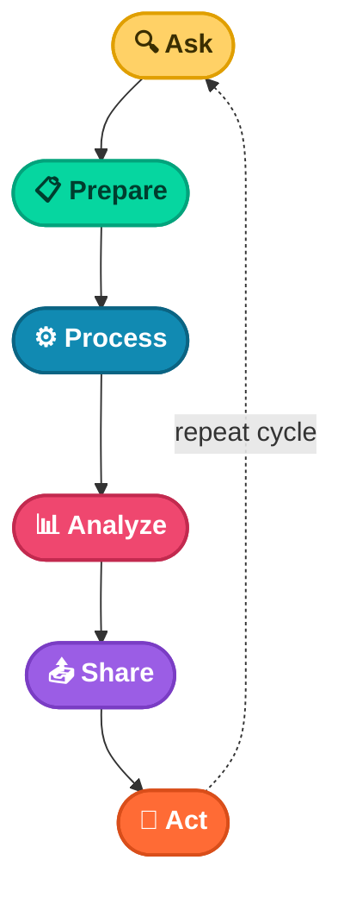

# 📖 Chapter 1
## People Analytics & The Data Analysis Process

*A field guide to solving real workplace problems with data*

---

### 📑 In This Chapter

1. [Overview](#-overview)
2. [What Is People Analytics?](#-what-is-people-analytics)
3. [The Six Steps of Data Analysis](#-the-six-steps-of-data-analysis)
4. [Case Study — Reducing New-Hire Turnover](#-case-study-reducing-new-hire-turnover)
5. [Is People Analytics Right for You?](#-is-people-analytics-right-for-you)
6. [Key Takeaways](#-key-takeaways)

---

## 🌍 Overview

Data is everywhere. Any time you observe and evaluate something in the world, you are collecting and analyzing data. This helps you:

- 🧭 Find easier ways of doing things
- ⏳ Identify patterns that save you time
- ✨ Discover surprising new perspectives that can change how you experience things

This chapter tells a real-life story of how a team of data analysts used the **six steps of data analysis** to solve a workplace problem. Their story involves something called **people analytics**.

---

## 🧑‍💼 What Is People Analytics?

> 🗂️ **Definition**
> People analytics — also known as human resources analytics or workforce analytics — is the practice of collecting and analyzing data on the people who make up a company's workforce, in order to gain insights that improve how the company operates.

Being a people analyst means using data to understand employees and how they experience their work lives. These insights help:

| Goal | What It Looks Like |
|---|---|
| 🚀 Productivity | A more productive, empowering workplace |
| 🌱 Potential | Unlocking employee potential |
| 🔥 Motivation | Helping people perform at their best |
| ⚖️ Fairness | A fair and inclusive company culture |

---

## 🔄 The Six Steps of Data Analysis

The six steps of the data analysis process are: **Ask → Prepare → Process → Analyze → Share → Act.** These steps apply to *any* data analysis project — and they form a cycle, not a one-time event.

Now, let's see how a team of people analysts used these six steps to answer a real business question.

---

## 🏢 Case Study: Reducing New-Hire Turnover

<table>
<tr><td>🚩 <b>The Problem</b></td><td>An organization was experiencing a high turnover rate among new hires. Many employees left the company before the end of their first year.</td></tr>
<tr><td>❓ <b>The Question</b></td><td><i>How can the organization improve the retention rate for new employees?</i></td></tr>
</table>

Here is what the team did, step by step.

 

### 🔍 Step 1 — Ask

First, the analysts needed to define what the project would look like and what would count as a successful result. They asked effective questions and worked with leaders and managers who cared about the outcome.

**Questions they asked:**

- What do you think new employees need to learn to be successful in their first year on the job?
- Have you gathered data from new employees before? If so, may we have access to the historical data?
- Do you believe managers with higher retention rates offer new employees something extra or unique?
- What do you suspect is a leading cause of dissatisfaction among new employees?
- By what percentage would you like employee retention to increase in the next fiscal year?

 

### 📋 Step 2 — Prepare

The team built a timeline of three months and decided how to share progress with stakeholders. They also identified what data they needed — in this case, an online survey of new employees.

**What they did to prepare:**

- ✅ Developed specific questions about employee satisfaction with hiring, onboarding, and compensation
- 🔒 Established access rules — raw data stayed internal; only summarized or aggregated data was shared (e.g., salary *ranges*, never individual compensation)
- 🎯 Finalized what information to gather and how to present it visually
- ⚠️ Brainstormed possible project and data risks, and planned how to avoid them

 

### ⚙️ Step 3 — Process

The group sent the survey out. Great analysts know how to respect both their data *and* the people who provide it.

> 🤝 **Ethics Checkpoint**
> Every employee gave informed consent to participate, and understood exactly how their data would be collected, stored, managed, and protected.

**Steps taken to protect the data:**

- 🔐 Restricted data access to a limited number of analysts
- 🧹 Cleaned the data for completeness, correctness, and relevance — aggregating and summarizing without revealing individual responses
- 🏦 Uploaded raw data to a secure internal data warehouse

 

### 📊 Step 4 — Analyze

Then the analysts did what they do best: **analyze!** From the completed surveys, they discovered that an employee's experience with certain processes was a key indicator of overall job satisfaction.

| 🔎 Finding | ➡️ Outcome |
|---|---|
| Experienced a long, complicated hiring process | 🚪 Most likely to **leave** the company |
| Experienced an efficient, transparent evaluation & feedback process | 🌟 Most likely to **stay** with the company |

> 📝 The group documented *exactly* what they found — no matter the result. Doing otherwise would reduce trust in the survey process and make it harder to collect truthful data in the future.

 

### 📤 Step 5 — Share

Just as they carefully protected the data, the analysts were equally careful when sharing the report.

**How they shared their findings:**

- 📬 Shared the report only with managers who met the minimum number of direct-report responses
- 🖥️ Presented the results to managers first, so they had the full picture
- 🗣️ Asked managers to personally deliver the results to their own teams

This gave managers the context to lead **productive team conversations** about next steps to improve employee engagement.

 

### 🚀 Step 6 — Act

The final step: work with leaders to decide how to implement changes based on the findings.

**Recommendations:**

1. 🛠️ Standardize the hiring and evaluation process around the most efficient, transparent practices
2. 🔁 Conduct the same survey annually and compare results year over year

> 🏆 **The Result**
> A year later, the same survey was distributed again. The comparison showed the action plan worked — **retention improved**, and leadership's changes were a success!

---

## 🌱 Is People Analytics Right for You?

One of the many things that makes data analytics so exciting is that the problems are always different, the solutions need creativity, and the impact on others can be great — even life-changing or life-saving.

As a data analyst, you can be part of these efforts. Maybe you're even inspired to learn more about people analytics. If so, consider researching the field and adding what you learn to your data analytics journal.

> 💭 You never know — one day soon, you could be helping a company create an amazing work environment for you and your colleagues!

---

## 🔑 Key Takeaways

- 🔄 People analytics applies the six-step data analysis process to HR challenges
- 🤝 Ethics and employee consent are **non-negotiable**
- 🔍 Transparent hiring and evaluation processes are linked to better retention
- 📣 Sharing results *through managers* leads to better team conversations and action
- 📆 Repeating surveys over time helps measure long-term impact
- 💡 Data analytics is creative, impactful, and always interesting

---

📘 *Data Analytics Notes Series* · Chapter 01

