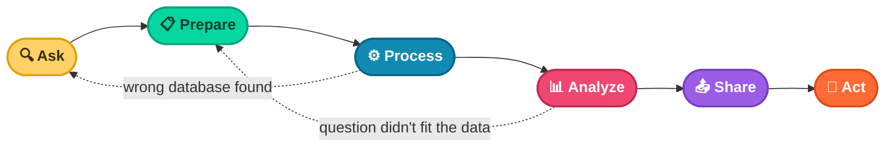

# 📖 Chapter 2
## The Six Phases, In Depth — A Training Investment Case Study

*Understanding each phase on its own terms, and why the process bends but never breaks*

---

### 📑 In This Chapter

1. [The Six Phases of Data Analysis](#-the-six-phases-of-data-analysis-1)
2. [Putting the Process Into Practice](#-putting-the-process-into-practice)
3. [Iteration During the Data Analysis Process](#-iteration-during-the-data-analysis-process)
4. [Key Takeaways](#-key-takeaways-1)

---

## 🔄 The Six Phases of Data Analysis

The data analysis process is made up of six phases — **ask, prepare, process, analyze, share, act** — and their purpose is simple: to gain insights that drive informed decision-making.

| Phase | What Happens |
|---|---|
| 🔍 **Ask** | Understand the challenge or question, usually assigned by stakeholders |
| 📋 **Prepare** | Find, collect, and verify the data needed to answer it |
| ⚙️ **Process** | Clean and organize the data — fix inconsistencies, fill gaps, reformat |
| 📊 **Analyze** | Do the analysis — averages, counts, trends, patterns |
| 📤 **Share** | Present findings via report, presentation, or visualization |
| 🚀 **Act** | Put the insights into action — strategy, product, or process change |

> 🧩 **Why It Works**
> The process breaks a big, vague business problem into a series of manageable tasks — each phase feeding directly into the next.

---

## 🏢 Putting the Process Into Practice

### The Retirement Contribution Dilemma

<table>
<tr><td>🏭 <b>Company</b></td><td>Geo-Flow, Inc. — a fictional midsized tech company</td></tr>
<tr><td>🚩 <b>The Problem</b></td><td>Employee participation in the company's retirement contribution program was lower than expected, despite a world-class benefits program built to reduce turnover</td></tr>
<tr><td>❓ <b>The Ask</b></td><td>Leaders asked the data analytics team to recommend whether an educational training program was worth the investment</td></tr>
</table>

 

### 🔍 Ask

The analysts defined the problem with two clear research questions:

- Are employees investing in the company's retirement contribution program?
- If not, should we create an educational program to encourage participation?

 

### 📋 Prepare

They gathered relevant data from HR, including:

- 👥 Employee demographics
- 💰 Salary levels
- 💵 Current retirement contributions

 

### ⚙️ Process

The team cleaned and organized the data:

- 🧹 Removed duplicates and records from employees who had retired or left the company
- 🗂️ Sorted data by age, department, and length of employment

 

### 📊 Analyze

The analysis revealed a clear pattern:

> 📌 **Finding**
> Certain employee groups were less likely to contribute to the plan — or didn't even know the company offered a matching contribution.

The analysts interpreted this to mean these groups weren't receiving enough education about the matching program, and used data visualization to explore the trend from multiple angles.

 

### 📤 Share

Findings were shared with the management team using clear, decision-ready visuals:

- 📊 Bar charts
- 🥧 Pie charts

**The headline:** overall participation was decent, but specific employee groups weren't taking full advantage of the program — and education could change that.

 

### 🚀 Act

Based on the findings, Geo-Flow created a **targeted educational program** focused on the benefits of retirement contributions, aimed specifically at the low-contributing groups.

> 🏆 **The Result**
> A few months after the training launched, the targeted groups showed a **significant increase** in retirement contributions.

---

## 🔁 Iteration During the Data Analysis Process

The data analysis process is designed to build on itself — the output of each phase becomes the input for the next. But it's rarely a straight line.

Common reasons analysts loop backward:

- 🗄️ You're in the **analyze** phase and discover the data came from the wrong database → back to **prepare**
- ❓ While cleaning data, you realize your original question didn't fully define the problem → back to **ask**

> ⚠️ **The Real Mistake**
> The biggest mistake analysts make isn't looping back — it's skipping steps in search of a quick, easy answer.

Reviewing your work at every phase isn't optional polish. It's how you learn more about the problem, sharpen your own skills, and build the kind of continuous growth that drives long-term success as a data professional.

---

## 🔑 Key Takeaways

- 🔄 The six phases — ask, prepare, process, analyze, share, act — turn big problems into manageable tasks
- 🏢 The Geo-Flow case shows the framework applied to a real-feeling business decision: training investment
- 🔁 The process **isn't strictly linear** — looping back to an earlier phase with better information is normal and healthy
- 🚫 Skipping steps in search of a fast answer is the most common (and costly) mistake analysts make
- 🧠 Reviewing each phase builds both better results and stronger analyst skills over time

---

📘 *Data Analytics Notes Series* · Chapter 02

