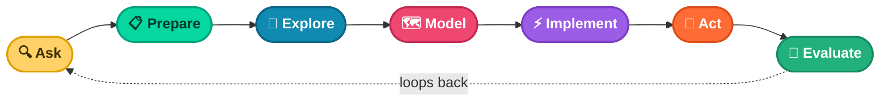
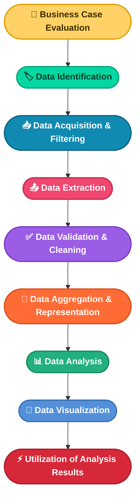

# 📖 Chapter 3
## Origins of the Data Analysis Process

*From papyrus to pipelines — how the same core ideas keep reappearing*

---

### 📑 In This Chapter

1. [Where Data Analysis Began](#-where-data-analysis-began)
2. [The Ask–Prepare–Process–Analyze–Share–Act Model](#-the-askprepareprocessanalyzeshareact-model)
3. [EMC's Cyclical Process](#-emcs-cyclical-process)
4. [SAS's Iterative Process](#-sass-iterative-process)
5. [Project-Based Data Analytics Process](#-project-based-data-analytics-process)
6. [Big Data Analytics Process](#-big-data-analytics-process)
7. [Key Takeaway](#-key-takeaway)

---

## 🏺 Where Data Analysis Began

No one knows exactly when or why the first person decided to record data about people and things — but it was a smart idea, and it stuck.

> 🧱 **A Long History**
> Data analysis is rooted in statistics, and archaeologists trace the start of statistics back to **ancient Egypt** and the building of the pyramids.

The ancient Egyptians were master organizers. They documented calculations and theories on **papyri** — paper-like materials now considered the earliest examples of spreadsheets and checklists.

> 🪶 Today's data analysts owe a real debt to those ancient scribes, who helped build a more technical and efficient way of working with information.

There isn't one single, universally followed structure for the data analysis process — but there *are* shared fundamentals across every major model. This chapter walks through five of them.

---

## 🔄 The Ask–Prepare–Process–Analyze–Share–Act Model

This is the foundational six-phase model used throughout this course.

| Phase | Focus |
|---|---|
| 🔍 **Ask** | Business challenge, objective, or question |
| 📋 **Prepare** | Data generation, collection, storage, and management |
| ⚙️ **Process** | Data cleaning and data integrity |
| 📊 **Analyze** | Data exploration, visualization, and analysis |
| 📤 **Share** | Communicating and interpreting results |
| 🚀 **Act** | Putting insights to work to solve the problem |

This model — and its many variations — will guide your approach as you grow as an analyst. Let's look at a few of those variations.

---

## 🌀 EMC's Cyclical Process

<table>
<tr><td>🏢 <b>Created By</b></td><td>David Dietrich, originally at EMC Corporation (now Dell EMC)</td></tr>
<tr><td>🔢 <b>Steps</b></td><td>6</td></tr>
<tr><td>🔁 <b>Shape</b></td><td>Cyclical — phases connect, lead into each other, and repeat</td></tr>
</table>

Key questions at each phase help analysts confirm they've done enough to move forward — and prevent teams from starting to model before the data is actually ready.

> 🧩 **Shared DNA**
> Even though the names differ, EMC's model shares core ideas with the six-phase model: start by discovering and asking questions, prepare data before analyzing it, then share and act on findings.

---

## ♾️ SAS's Iterative Process

<table>
<tr><td>🏢 <b>Created By</b></td><td>SAS — a leading data analytics solutions provider</td></tr>
<tr><td>🔢 <b>Steps</b></td><td>7</td></tr>
<tr><td>🔁 <b>Shape</b></td><td>Visualized as an infinity symbol</td></tr>
</table>

This process is designed to produce **repeatable, reliable, and predictive** results. It mirrors familiar steps like ask, prepare, model, and act — but adds something new:

> 🧪 **The Evaluate Step**
> A dedicated step *after* act, built to help analysts assess how well their solution actually worked — and loop back to ask if it didn't.

---

## 🧱 Project-Based Data Analytics Process

<table>
<tr><td>🏢 <b>Created By</b></td><td>Vignesh Prajapati</td></tr>
<tr><td>🔢 <b>Steps</b></td><td>5</td></tr>
<tr><td>⚠️ <b>Notable Gap</b></td><td>No dedicated "act" phase</td></tr>
</table>

This model skips a formal sixth phase, but still covers the essentials: identify the problem, prepare and process data before analysis, and finish with visualization.

---

## 🗂️ Big Data Analytics Process

<table>
<tr><td>🏢 <b>Created By</b></td><td>Thomas Erl, Wajid Khattak, and Paul Buhler — <i>Big Data Fundamentals: Concepts, Drivers &amp; Techniques</i></td></tr>
<tr><td>🔢 <b>Steps</b></td><td>9</td></tr>
<tr><td>🔬 <b>Notable Trait</b></td><td>Breaks "prepare" and "process" into much finer-grained steps</td></tr>
</table>

> 🔎 **It Looks Bigger — But Isn't Really Different**
> This process has three or four more steps than the others, but in reality, it has simply broken "prepare" and "process" into smaller, more granular tasks. It emphasizes everything that has to happen before analysis can even begin.

---

## 🔑 Key Takeaway

From the pyramids of ancient Egypt to today's big data pipelines, the way people analyze data has evolved — and continues to evolve.

> 🏛️ **Architecture, Not Doctrine**
> The data analysis process is like real-life architecture: there are different ways to build it, but the same core ideas show up in every model.

| Model | Steps | Notable Trait |
|---|---|---|
| 🔄 Core Six-Phase Model | 6 | The foundation this course is built on |
| 🌀 EMC's Process | 6 | Cyclical; repeats after operationalizing |
| ♾️ SAS's Process | 7 | Adds an evaluate step; visualized as infinity |
| 🧱 Project-Based Process | 5 | No dedicated act phase |
| 🗂️ Big Data Process | 9 | Breaks prepare/process into finer steps |

Whichever structure you use — the standard one or any of its many cousins — your approach will be effective, as long as the core ideas stay intact: **ask, prepare, analyze, and act.**

---

📘 *Data Analytics Notes Series* · Chapter 03

