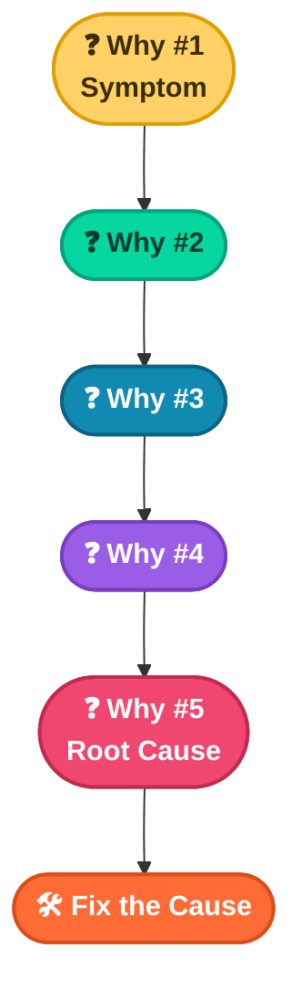

# 📖 Chapter 5
## The Five Whys — Root Cause Analysis in Action

*A simple question, asked five times, that gets you past the symptom and into the cause*

---

### 📑 In This Chapter

1. [What Is a Root Cause?](#-what-is-a-root-cause)
2. [The Five Whys Technique](#-the-five-whys-technique)
3. [Case Study — Boosting Customer Service](#-case-study-boosting-customer-service)
4. [Case Study — Advancing Quality Control](#-case-study-advancing-quality-control)
5. [Key Takeaways](#-key-takeaways)

---

## 🧩 What Is a Root Cause?

Business solutions almost always require some data detective work — and one of the most common questions a data professional asks is:

> ❓ **"What is the root cause of the problem?"**

A **root cause** is the underlying reason a problem occurs. Identify it, eliminate it, and the problem stops recurring. Treat only the symptom, and it comes right back.

---

## 🔁 The Five Whys Technique

The five whys is a simple but effective technique for digging down to a root cause. The method is exactly what it sounds like:

> 🗣️ Ask **"Why?"** repeatedly until the real answer reveals itself.

That often happens by the fifth "why" — but sometimes it takes more, sometimes fewer. The goal isn't to hit a magic number; it's to keep going until you reach something the organization can actually act on.

---

## 🛒 Case Study: Boosting Customer Service

<table>
<tr><td>🏢 <b>Company</b></td><td>An online grocery store</td></tr>
<tr><td>🚩 <b>The Problem</b></td><td>Numerous customer complaints about poor deliveries</td></tr>
</table>

| Why # | Question | Answer Uncovered |
|---|---|---|
| 1️⃣ | Customers are complaining about poor deliveries. Why? | Most complaints were about products arriving **damaged** |
| 2️⃣ | Products are arriving damaged. Why? | Products were **not packaged properly** |
| 3️⃣ | Products are not packaged properly. Why? | Grocery packers were **not adequately trained** on packing procedures |
| 4️⃣ | Packers are not adequately trained. Why? | ~**35% of packers were new hires** who hadn't completed required training |
| 5️⃣ | Packers haven't completed required training. Why? | HR hadn't trained new hires — it was mid-reworking its training program and used a **one-page guide** instead |

> 🎯 **Root Cause**
> 

> HR had not finished updating its training program, and was relying on a thin, one-page guide to onboard new packers instead of the full system.

> ✅ **Outcome**
> The grocer gave HR the support needed to finish the training overhaul and retrained all newly hired packers.

---

## 💧 Case Study: Advancing Quality Control

<table>
<tr><td>🏢 <b>Company</b></td><td>An irrigation company</td></tr>
<tr><td>🚩 <b>The Problem</b></td><td>A rising number of defects in water pumps</td></tr>
</table>

| Why # | Question | Answer Uncovered |
|---|---|---|
| 1️⃣ | There's been an increase in pump defects. Why? | The machines producing the pumps were **not properly calibrated** |
| 2️⃣ | The machines are not properly calibrated. Why? | They were **miscalibrated during the last maintenance cycle** |
| 3️⃣ | The machines were miscalibrated during maintenance. Why? | The current calibration **method was inappropriate** for the machines |
| 4️⃣ | The calibration method is inappropriate for the machines. Why? | New software had recently been installed, and engineers **didn't realize it affected calibration** |
| 5️⃣ | Engineers don't have the info needed to calibrate the upgraded machines. Why? | The installation team **never shared** the updated calibration procedures with engineers |

> 🎯 **Root Cause**
> Engineers were missing the calibration procedures needed for the newly upgraded machine software — information the installation team never passed along.

> ✅ **Outcome**
> Engineers received the missing calibration instructions and implemented them immediately — pump defects were eliminated.

---

## 🔑 Key Takeaways

- 🌱 A **root cause** is the actual reason a problem occurs — fix it, and the problem stops recurring
- 🔁 The **five whys** technique surfaces root causes by repeatedly asking "why?" — usually around five times, sometimes more or fewer
- 🛒 In the grocery case, a delivery complaint traced back to an **incomplete HR training rollout**
- 💧 In the irrigation case, a defect spike traced back to a **missing handoff of calibration procedures**
- 🤝 The technique doubles as a collaboration tool — it pulls in colleagues from other parts of the business along the way
- 🌍 The five whys works across **any industry**, and is a great tool to reach for whenever you feel stuck on a problem

---

📘 *Data Analytics Notes Series* · Chapter 05

